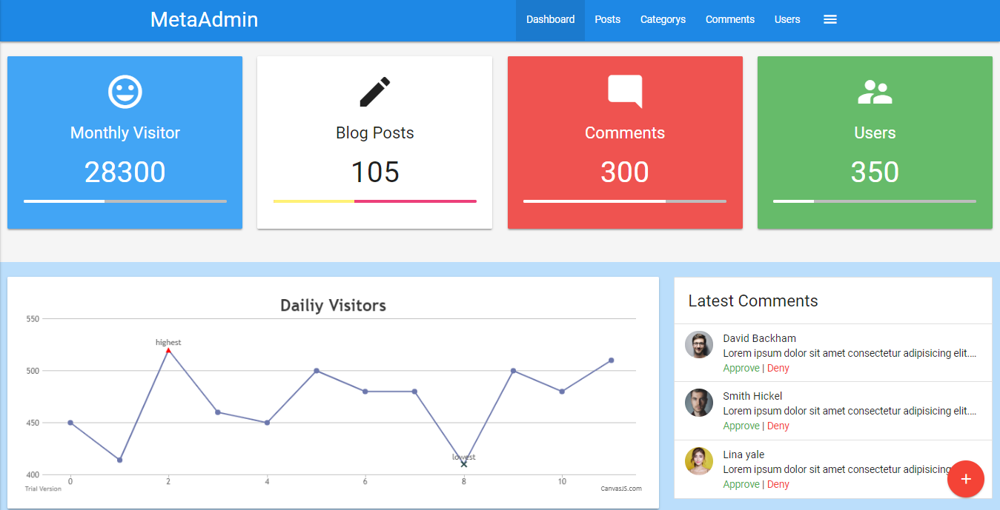
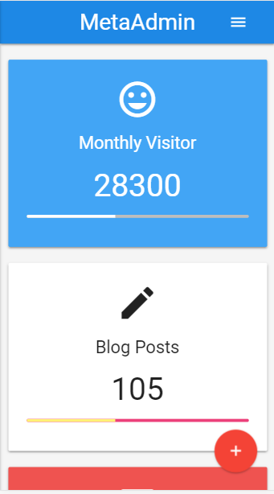
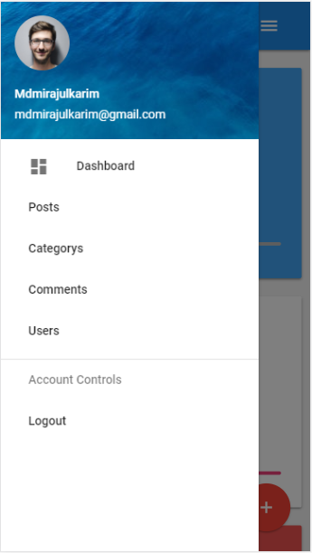
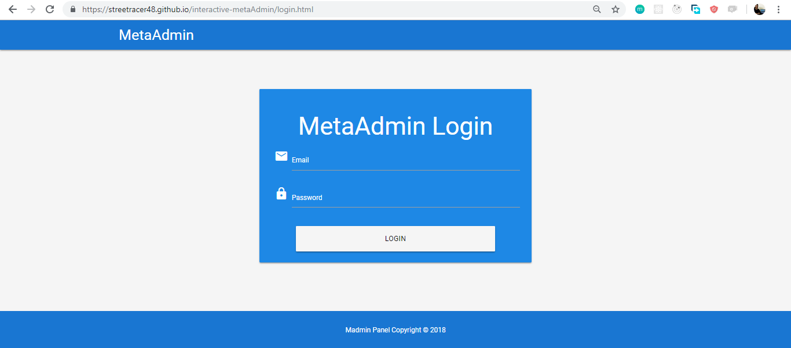
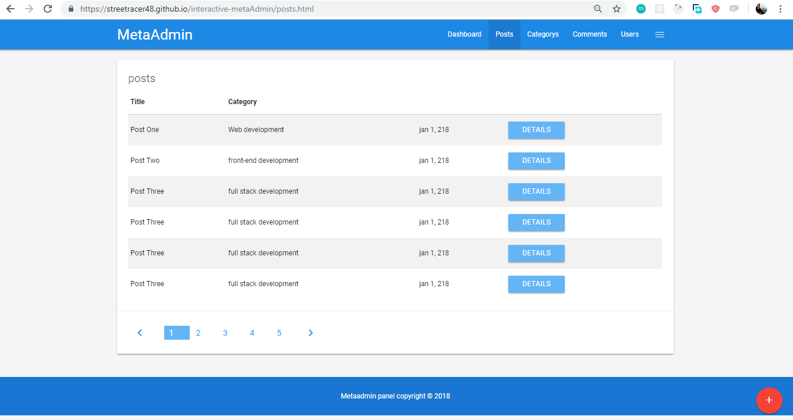
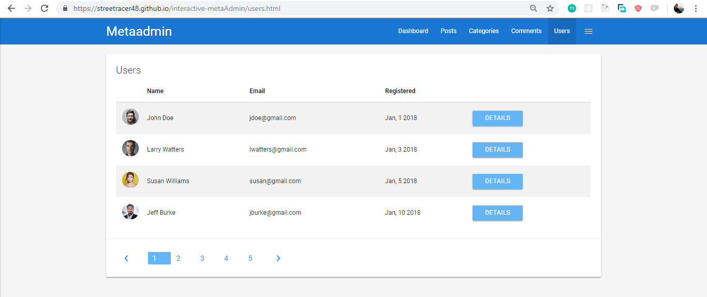
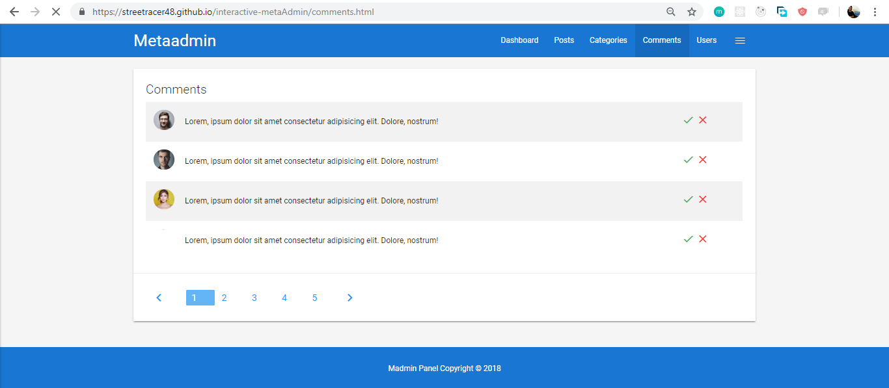
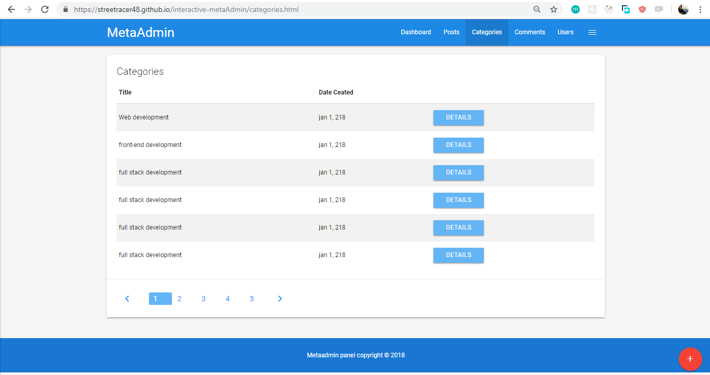
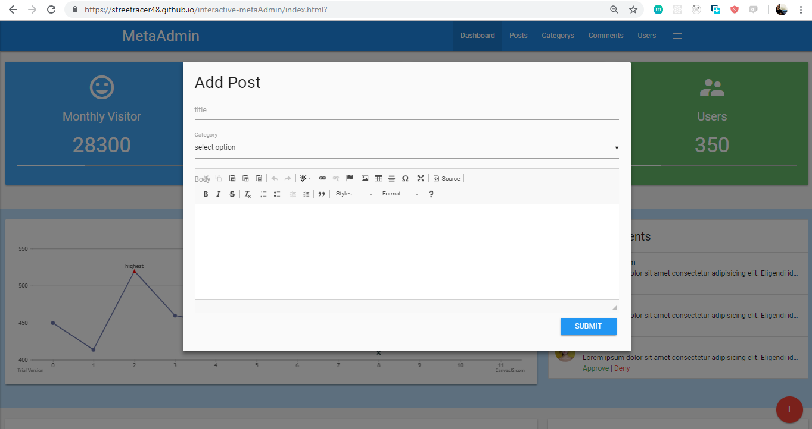

# 

## interactive-metaAdmin

## About

 ` Responsive interactive-metaAdmin this is  my learning based project done 100% work`

 

## Feature
- `Welcome Dashboard,`

- `Mobile Responsive`

- `mobile navbar`

- `Login page`

- `posts page`

- `users profile system`

- `comments`

- `categories page`

- `add posts modal`

## Following technologies are used

- `Material-CSS`
- `HTML`
- `CSS`
- `Canvas JS`
- `Jquery`
- `Font-Awsome`
- `Materials-icons`
- `Google-fonts`

  
 
     

## Supported Browsers

`By default, the generated project supports all modern browsers and Mobile.`  
   

                                                                                                                                                                                                                                                                                                                                                                     
